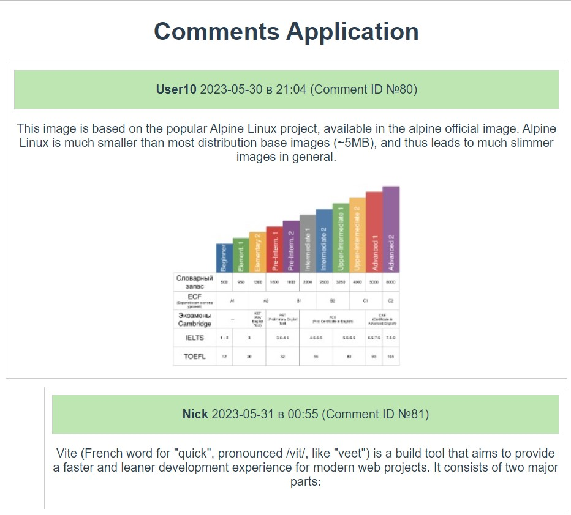
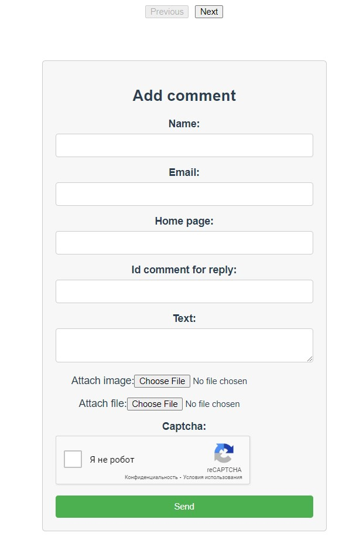

# Single Page Application - Comments
This is a test application where users can write messages and comment on other messages. All messages are stored in a database along with user information. Users can attach images (.jpg, .gif, .png) to their messages, which are automatically resized to 320x240 px if larger. Text files (.txt) can also be attached to messages.

Each comment submission is accompanied by a captcha confirmation to prevent automated submissions. The application also includes protection against XSS (Cross-Site Scripting) attacks to ensure security.

The application is built using Django REST Framework, Vue.js and PostgreSQL.  

## Project setup
Docker must be installed.  
Fork the repo (GitHub repository)  
Clone the forked repo
```
git clone the-link-from-your-forked-repo
```
Open the project folder in your IDE
Open a terminal in the project folder
```
docker-compose build
docker-compose up
```
Run at http://localhost:8080/


### ScreenShots




* if you don't see Captcha image, at first visit to this site, please reload the page.